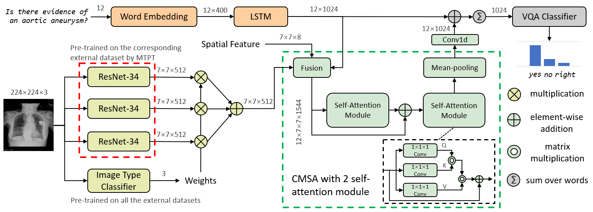
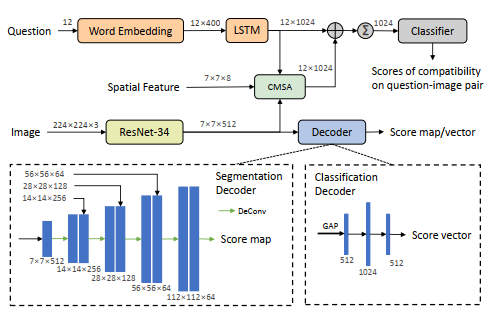
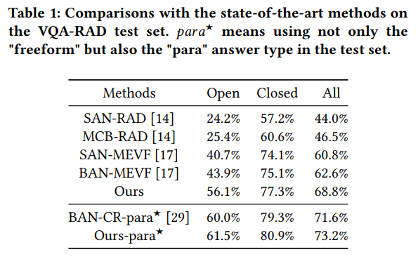

# Cross-Modal Self-Attention with Multi-Task Pre-Training for Medical Visual Question Answering

This repository is the official implementation of `CMSA-MTPT` for the visual question answering task in medical domain. Our model achieved **56.1** for open-ended and **77.3** for close-end on [VQA-RAD dataset](https://www.nature.com/articles/sdata2018251#data-citations). Up to 2021-4-23, the proposed models achieves the `SOTA` on the VQA-RAD dataset. For the detail, please refer to [link](https://arxiv.org/abs/xxxx.xxxx).

The main contributer of this code is Guanqi Chen [link](https://github.com/chenguanqi). This repository is based on and inspired by @Jin-Hwa Kim's [work](https://github.com/jnhwkim/ban-vqa) and @Aizo-ai's [work](https://github.com/aioz-ai/MICCAI19-MedVQA). We sincerely thank for their sharing of the codes.


### Citation

Please cite these papers in your publications if it helps your research

```
@inproceedings{gongchen2020cross,
  author={Haifan Gong, Guanqi Chen, Sishuo Liu, Yizhou Yu, and Guanbin Li},
  title={Cross-Modal Self-Attention with Multi-Task Pre-Training for Medical Visual Question Answering},
  booktitle = {ACM International Conference on Multimedia Retrieval(ICMR)},
  year={2021}
}
```

Overview of the proposed medical VQA model. Our method consists of four components (with different colors in the figure): image feature extractor, question encoder, cross-modal self-attention (CMSA) module, and answer predictor.


Multi-Task Pre-Training: the model is jointly trained with an image understanding task and a questionimage compatibility task. Depending on the dataset-specific image understanding task, the decoder can be selected as a fully convolutional network or a fully connected network.

### Prerequisites
torch                       1.0.1
torchvision                 0.4.0a0
numpy                       1.19.1

### Preprocessing

The processed data should be downloaded via [link](https://pan.baidu.com/s/1MR81OMZLLIFHLyUcgiSbpA) with the extract code: `tkm8`. The downloaded file should be extracted to `data_RAD/` directory.

### Training and Testing
Just run the `train.sh` and the `test.sh` for training and evaluation.
The result json file can be found in the directory `results/`.

### Comaprison with the sota


### Pretrained models
The multi-task pretrained models and the models for evaluation can be downloaded from [link](https://pan.baidu.com/s/1VQCAVADmrzEeRnW8GzsMfA) with extract code: `163k`. 

### License
MIT License

### More information
If you have any problem, no hesitate contact us at haifangong@outlook.com
HCP Lab Homepage: https://hcp.tioyotech.com/
